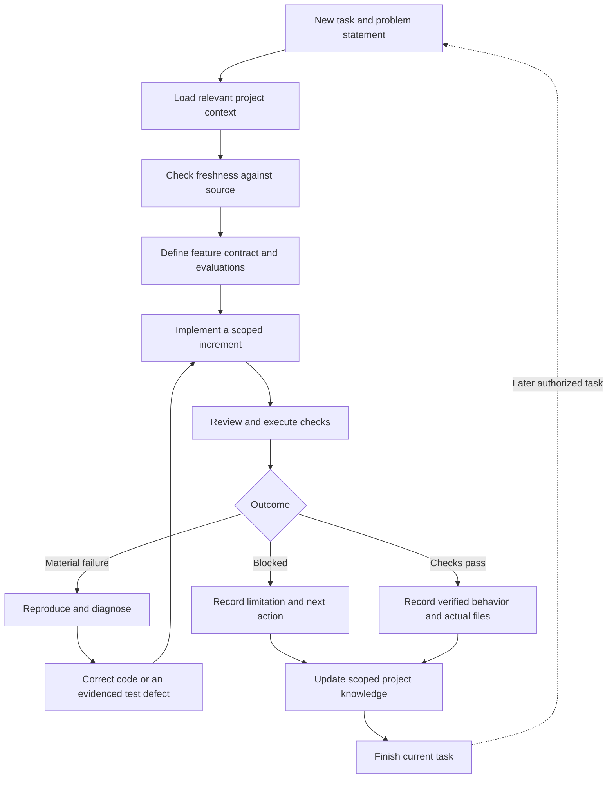

# Implementing the self-learning loop

This is the implementation design for extending Production Engineering Loop's learning workflow introduced in v0.2.0. The v0.3.0 feature contract adds the supplied PRI structure, focused code locations, and explicit red/green guidance. The Markdown instructions, templates, and a bounded feature-build evaluation exist. Optional scripts and the multi-session evaluation harness below are proposed work, not implemented components or measured benefits.

v0.4.0 prioritized code quality and made [compact/full documentation](../skills/production-engineering-loop/references/documentation-modes.md) explicit. v0.5.0 added a [fresh-review and resolution protocol](../skills/production-engineering-loop/references/independent-review.md) and optional [source provenance helper](../skills/production-engineering-loop/references/review-evidence.md). v0.6.0 keeps that workflow host-neutral and adds installed guidance for Codex, Claude Code, Cursor, Gemini CLI, Qwen Code, and OpenCode. The memory/index automation components described below remain proposals. Both documentation formats retain applicable quality checks. The [v0.3.0 audit](audit-2026-09-18.md) demonstrated one fresh-session continuation with stale-path recovery; it is historical evidence.

## What learns

The project accumulates verified knowledge and better evaluations. On a later task, the agent retrieves that knowledge, checks it against current source, and uses it to make a better decision. Model weights do not change. Installing a skill does not start a background service.

Three kinds of improvement have different lifecycles:

| Layer | Retained artifact | How it improves |
| --- | --- | --- |
| Project understanding | Product goals, stack, architecture, file responsibilities, feature index | Less repeated discovery; fewer incorrect assumptions |
| Feature reliability | Acceptance contracts, test cases, execution evidence | Discovered failure modes become checks for later changes |
| Reusable engineering guidance | Scoped project lessons; separately reviewed skill changes | Supported corrections influence later relevant decisions |

Documentation alone is memory. A demonstrated learning loop also needs retrieval, application, and evaluation on a subsequent task.



The next task is a new authorized request or an accepted plan increment. The loop does not automatically consume the backlog. Fix iterations stop on completion or an unresolved concrete blocker; they do not repeat indefinitely until a model produces a favorable judgment.

## 1. Bootstrap understanding once, then refresh incrementally

Start with the problem statement. Extract the intended users, their problem, desired workflows, constraints, success criteria, and non-goals. Keep user decisions distinct from inferred behavior. If no code exists, record a proposed architecture rather than pretending the project is implemented.

For an existing repository, inspect its instructions, worktree, manifests and lockfiles, entry points, tests, schemas, architecture decisions, and CI. Map first-party modules and their responsibilities. For an explicit whole-codebase request, track first-party source inspection in batches. Exclude dependencies and generated artifacts from routine source reading, but inspect relevant generators and external contracts. Record unread or inaccessible areas.

Persist a compact `PROJECT.md`, reusing equivalent repository documentation when it already exists. It should answer:

- What is the user building and what are they currently asking for?
- What stack is actually present, with evidence for declared and resolved versions?
- Where do important responsibilities, entry points, and data flows live?
- Which features exist, which are incomplete, and where are their records?
- How are checks run, and which environment prerequisites matter?
- What was inspected, what remains unknown, and when was this verified?

Keep a responsibility map, not a second copy of the source tree. List important files individually; group repetitive files. Each feature's record captures the actual created, changed, renamed, and removed paths attributable to that task. Git is useful for discovering candidates, but a diff may include unrelated user edits that must not be attributed to the agent.

## 2. Store portable, reviewable memory

The existing default layout in the target project is:

```text
docs/engineering-loop/
  PROJECT.md
  features/
    stock-adjustment.md
  LESSONS.md                 # Only after an evidenced lesson exists

tests/                      # Use the repository's real test convention
```

`PROJECT.md` is the current summary. Feature records contain requirements, file changes, evaluation plans, historical runs, and current limitations. `LESSONS.md` contains reusable decisions with evidence and conditions. Tests remain in the native test suite so they can run without this skill.

Do not retain entire conversations, secret values, private customer data, or arbitrary tool output. Summarize decisions and retain stable links to the necessary evidence. Read-only tasks can read memory and propose updates, but cannot write it. Respect explicit file restrictions and repository documentation policies.

For automation, add structured fields to these documents or a small machine-readable index referencing them. Avoid duplicating all prose into a second database. Useful fields are:

| Record | Minimum structured fields |
| --- | --- |
| Project snapshot | Schema version, inspection date, source revision, dirty state, inspected paths, relevant manifest fingerprints |
| Feature | Stable ID, requirement source, criteria IDs, implementation paths, evaluation locations, implementation status, verification status |
| Lesson | Stable ID, statement, applicability, evidence references, exceptions, freshness basis, lifecycle status |
| Evaluation run | Unique run ID, feature/criteria IDs, command and working directory, source snapshot, environment, start/end time, exit status, observed result, limitations |

Use separate implementation and verification states. A feature can be implemented while integration validation is blocked. A historical passing run remains historical when the code changes.

## 3. Retrieve relevant context and check its freshness

At task start:

1. Load the small project summary.
2. Identify the requested feature, affected paths, callers, and contracts.
3. Retrieve matching feature records and lessons by feature ID, path/module, or affected boundary.
4. Check their evidence against current source, tests, manifests, and user decisions.
5. Refresh stale facts and retrieve further context only when needed.

Path-only matching is insufficient for cross-cutting rules. A lesson about transaction boundaries may apply to several features; a lesson about one provider's retry behavior may not apply to another provider. Store the condition that makes a lesson relevant, not just tags or keywords.

A changed source file, renamed path, dependency update, or changed requirement is a reason to revalidate relevant memory. Unchanged file hashes alone do not prove validity: transitive dependencies, build configuration, external contracts, and environment changes can matter. Where dependency impact is uncertain, broaden the relevant checks and state the uncertainty.

Git HEAD alone is not a sufficient snapshot identifier in a dirty worktree. Include dirty state and hashes of evaluated files and relevant manifests, or a reproducible patch/artifact reference. Without Git, use dated snapshots and file hashes. Avoid constantly changing memory because its own timestamps or evaluation logs changed.

## 4. Define feature evaluations before implementation

For each meaningful feature change, establish observable acceptance criteria from the problem statement and agreed contracts. Map each criterion to inputs, expected outputs or state changes, forbidden effects, and a check. Follow the feature contract's red/green sequence when testing is meaningful: add the relevant case, confirm failure for the intended behavior, implement, then refactor with tests green. Record structural validation as a TDD exception when executable testing is not meaningful; unavailable tooling remains a blocker.

Example for a stock-adjustment feature:

| ID | Case | Required result |
| --- | --- | --- |
| STOCK-1 | Stock 5, adjustment +2 | Return/store 7; other products unchanged |
| STOCK-2 | Stock 5, adjustment -5 | Return/store 0; product remains present |
| STOCK-3 | Stock 5, adjustment -6 | Raise the agreed error; no mutation |
| STOCK-4 | Unknown product | Raise the agreed error; no insertion or mutation |

Expected outcomes come from the requirements, not from whatever the current function returns. A test whose expected value calls the same production helper can reproduce its bug instead of detecting it.

Choose unit tests for local rules, integration or contract tests for boundaries, and end-to-end checks for critical workflows. Include accessibility, performance, and manual checks where material. For probabilistic features, define a reviewable rubric, representative evaluation data, and repeated trials when variation matters; keep held-out evaluation examples separate from examples used to develop the feature.

Preserve the distinction between an evaluation plan, an implemented test, and an executed passing result. A zero-exit test command may still have selected no tests; inspect the native runner's collection/results. Manual evidence should identify the procedure, observations, and limitations.

## 5. Run, diagnose, and improve

Implement a cohesive increment, inspect its actual behavior, and execute relevant checks. On failure, determine whether the issue is in the implementation, environment, test, or requirement. Preserve valid expectations; a failed test is not permission to weaken the criterion.

Capture baseline behavior and a reproduction when feasible. A greenfield project may have no runnable baseline; record that honestly. A failed environment setup does not establish a product defect. An unresolved explanation stays a hypothesis.

When a defect is established, correct the smallest relevant cause and rerun the affected checks. Inspect the changed callers and side effects. Run required repository gates before claiming verification. If the same attempt makes no progress, change the hypothesis or stop with the blocker rather than repeating it unchanged.

Record a run's actual command, working directory, code snapshot, relevant runtime/environment, result, and limitations. Keep output bounded and redacted. A command's exit status is evidence for that command, not proof of the entire acceptance contract.

## 6. Promote a finding into a scoped lesson

Use a small lifecycle:

```text
Observation → Hypothesis → Reproduced case → Verified correction → Active lesson
                                                                  ↓
                                               Revalidate / supersede / archive
```

Not every observation becomes a lesson, and not every successful task creates one. A verified correction means evidence supports the claim within its stated scope, not that it has been proved universal.

An illustrative lesson, not a failure observed in the initial stock test:

```yaml
id: STOCK-L001
status: active
statement: Validate the resulting quantity before mutating inventory.
applies_when: An operation adjusts caller-owned stock under an all-or-nothing contract.
evidence:
  reproduction: Underflow previously raised an error after modifying stock.
  regression: tests/test_inventory.py::test_underflow_is_atomic
  correction: Regression failed before the fix and passed after it.
limits:
  - Does not establish atomicity for persistent or concurrent updates.
next_time:
  - Include unchanged-state assertions for rejected adjustments.
  - Verify the commit point before adding another stock mutation path.
```

Store the concrete source revision/run references in a real record. Confidence adjectives or a numeric self-score cannot substitute for evidence. A user-confirmed product decision can be retained as a decision without inventing a failure to justify it.

## 7. Prove reuse on a later task

Suppose a later request adds a multi-item stock adjustment. Start a fresh agent session with access to the repository and skill, but no prior conversation. It should:

1. Load project context and identify the earlier stock lesson as potentially relevant.
2. Confirm the new feature's all-or-nothing requirement; do not invent it from the old single-item rule.
3. Check that the lesson's evidence and existing regression test still apply.
4. Define a case where an early item is valid but a later item fails.
5. Require the whole batch to remain unchanged on rejection if that is the agreed contract.
6. Implement accordingly and execute the evaluation.
7. Update the feature map and retain the distinction between in-memory mutation and database transaction guarantees.

The observable proof is that relevant prior evidence influenced the new evaluation and implementation. Reading `LESSONS.md` or saying “I learned” is not sufficient.

## 8. Optional automation: concrete components

The current Markdown workflow can operate without these scripts. Add deterministic helpers only after the manual loop is useful. Keep them optional, versioned, and portable; the core skill should remain usable with normal file and shell access.

| Proposed component | Inputs and output | Responsibility boundary |
| --- | --- | --- |
| `inspect_project.py` | Repository root → file/manifests inventory and snapshot | Facts and fingerprints; the agent supplies product/architecture interpretation |
| `check_context.py` | Records plus current snapshot → stale/missing evidence report | Flags changes; cannot infer that unchanged hashes prove semantic correctness |
| `record_evaluation.py` | Approved repository check, feature/criteria IDs → structured run record | Captures command/result/snapshot; does not execute commands suggested by untrusted lesson text |
| `validate_records.py` | Memory and referenced artifacts → integrity findings | Detects broken paths, missing required provenance, unsupported status transitions; does not score engineering quality |

Suggested implementation details:

- Use the standard library where sufficient. A text index and structured metadata can support the initial repository size; introduce search infrastructure only if retrieval quality or scale demands it.
- Execute approved test commands as argument arrays in a known working directory. Preserve the host's permissions and avoid shell interpolation of record contents.
- Write unique evaluation-run records, then update summaries. Use atomic file replacement and detect concurrent modifications before overwriting a user's records.
- Make record updates idempotent: update a matching feature/lesson ID rather than appending duplicate facts on every turn.
- Keep check statuses explicit: passed, failed, blocked, or not run. Separate native-runner results from the agent's interpretation of criterion coverage.
- Record an interrupted run as incomplete rather than retaining a stale “passed” summary.
- Let CI validate record integrity and run the native regression suite. CI should not invent product context, silently rewrite lessons, or treat document presence as proof of learning.

Conceptual orchestration, not runnable code:

```python
def handle_task(request, repo):
    scope = resolve_scope_and_permissions(request, repo.instructions)
    context = load_relevant_records(repo, request)
    context = verify_and_refresh_context(context, inspect_relevant_source(repo))
    contract = derive_contract(request, context)
    evaluations = define_evaluations(contract, repo.existing_checks)

    if scope.review_only:
        return inspect_and_report_without_writes(contract, evaluations)
    if scope.documentation_only:
        return persist_authorized_documentation(context, contract, evaluations)

    while scope.permits_progress:
        change = implement_or_correct(contract, evaluations)
        review = inspect_change_and_callers(change)
        runs = execute_authorized_relevant_checks(evaluations)
        if material_findings_resolved(review) and required_checks_pass(runs):
            break
        if blocked_or_no_new_supported_hypothesis(review, runs):
            break
        revise_implementation_hypothesis(review, runs)

    if scope.permits_memory_writes:
        record_actual_files_and_results(context, contract, change, runs)
        retain_only_evidenced_applicable_lessons(review, runs)
    return report_implementation_verification_and_release_separately()
```

## 9. Evaluate the learning mechanism itself

There are two evaluation suites: feature tests evaluate the code being built; skill evaluations test whether the agent learns and uses the workflow correctly. Passing the first does not establish the second.

The next decisive skill experiment is a controlled two-session run:

1. Use a local fixture with a documented contract and an actual seeded defect. Have session A reproduce, fix, test, and record a scoped lesson.
2. Preserve only the repository artifacts. Start session B without session A's transcript.
3. Request a related feature with an independently prepared evaluation case. Observe whether session B retrieves, revalidates, and applies the lesson.
4. Repeat with obsolete memory, an unrelated task, and a review-only request. Check that stale or irrelevant lessons do not drive edits and review-only mode creates no records.
5. Compare repeated matched runs with and without saved project memory using the same tasks, model settings, source snapshots, and tools. Randomize order where feasible; keep evaluator-only cases out of the implementation prompt.

Track feature correctness and escaped regressions first. Then inspect inappropriate edits, unsupported completion claims, stale-memory use, unnecessary rereading, elapsed time, and context cost. Do not optimize for more lessons or more tests. Report failures and variation rather than promising that memory always improves performance.

Current evidence: the [bounded forward test](../evals/learning-loop-result.md) exercised project mapping, evaluation artifacts, feature implementation, and result recording. It did not exercise learning from a failure or a second session retrieving a saved lesson. Those are the next meaningful checks before claiming demonstrated cross-session improvement.

## 10. Evolve the shared skill separately

Keep project learning local. If repeated evaluations reveal a general weakness in the skill, create a proposed skill change with a reproducing scenario, validate it against existing scenarios and independent cases, review its scope and portability, and release a versioned update. Do not let a project agent silently rewrite its installed skill or weaken checks that exposed its mistakes.

Recommended order: use the existing memory/evaluation workflow; prove two-session learning; add the smallest useful record helpers; test stale and irrelevant memory; then promote general improvements through the skill's normal contribution and release process.
